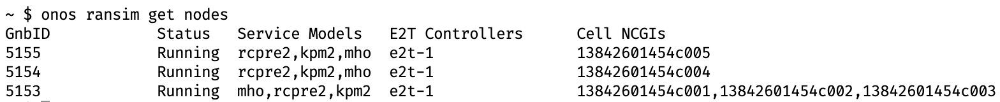
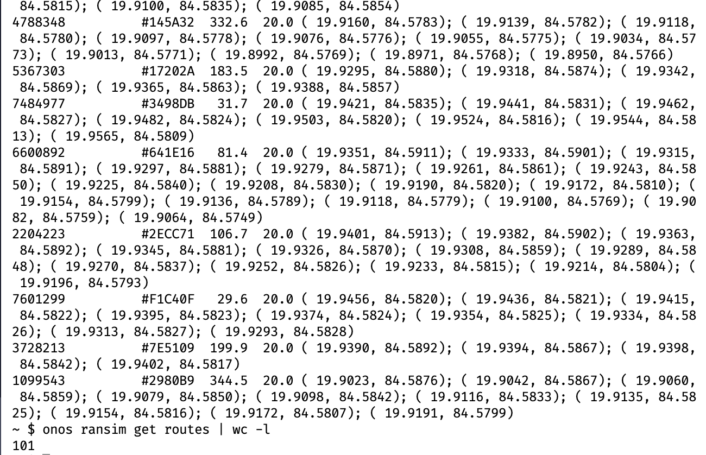
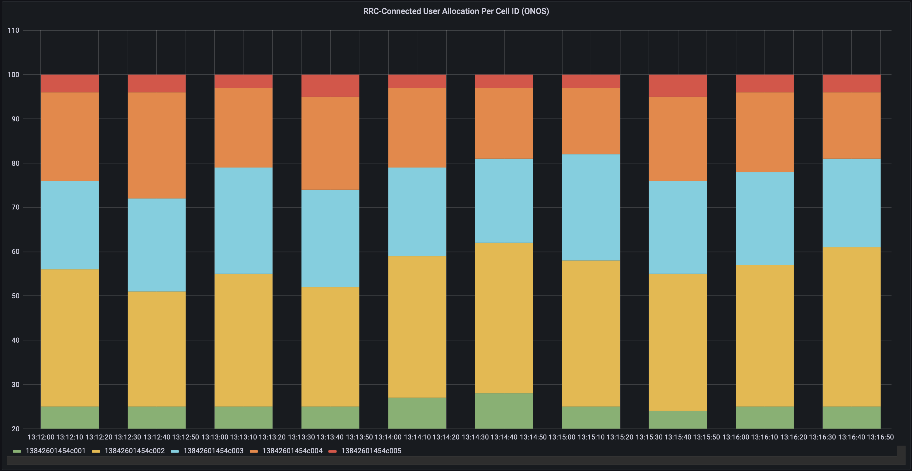
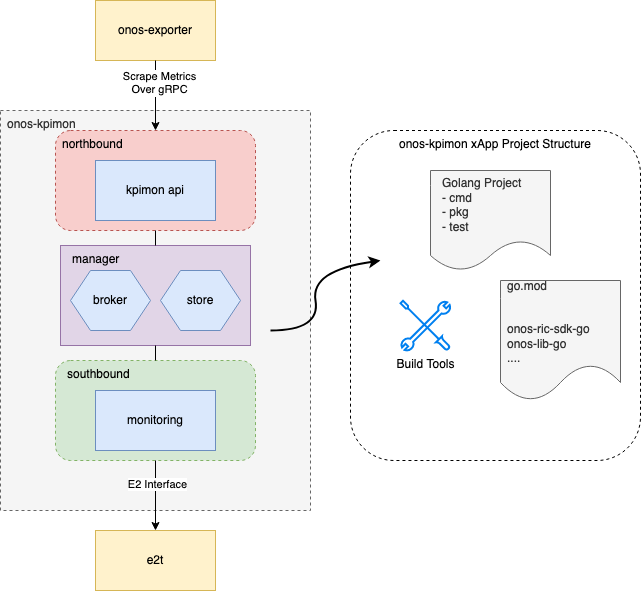

<!-- classes: title -->

# O-RAN Simulation
## Using SD-RAN (onosproject)

<!-- block-start: grid -->
<!-- account: github, dhanifudin -->
Dian Hanifudin Subhi
<!-- block-end -->

---

<!-- section-title: Outline -->

# Outline
## SD-RAN µONOS by onosproject

- Basic
- Installation
- Running Simulation
- Developing App

---

<!-- section-title: Basic of Docker -->

## Basic of Docker

Docker is an open platform for developing, shipping, and running applications.

---

## Docker Architecture


from https://docs.docker.com

---

## Docker Architecture (cont..)

- **Docker Daemon** (dockerd): daemon listens for Docker API requests and manages
  Docker objects.
- **Docker Client**: the primary way of users to interact with Docker.
- **Docker Desktop**: Application for Mac, Windows or Linux environment to make it easier
  to manage Docker and also Kubernetes.
- **Docker Registries**: registry to store Docker images. Example: Docker Hub
- **Docker Objects**: images, containers, networks, volumes, plugins and other
  objects.

---

## Virtualization vs Container


---

## Dockerfile

```Dockerfile
# SPDX-FileCopyrightText: 2019-present Open Networking Foundation <info@opennetworking.org>
#
# SPDX-License-Identifier: Apache-2.0

ARG ONOS_BUILD_VERSION=undefined

FROM onosproject/golang-build:v1.0 as build

ENV GO111MODULE=on
ARG ONOS_MAKE_TARGET=build

COPY Makefile go.mod go.sum /go/src/github.com/onosproject/onos-kpimon/
COPY cmd/ /go/src/github.com/onosproject/onos-kpimon/cmd/
COPY pkg/ /go/src/github.com/onosproject/onos-kpimon/pkg/
COPY vendor/ /go/src/github.com/onosproject/onos-kpimon/vendor/
COPY api/ /go/src/github.com/onosproject/onos-kpimon/api
COPY build/build-tools /go/src/github.com/onosproject/onos-kpimon/build/build-tools

RUN cd /go/src/github.com/onosproject/onos-kpimon && GOFLAGS=-mod=vendor make ${ONOS_MAKE_TARGET}

FROM alpine:3.11
RUN apk add libc6-compat

USER nobody

COPY --from=build /go/src/github.com/onosproject/onos-kpimon/build/_output/onos-kpimon /usr/local/bin/onos-kpimon

ENTRYPOINT ["onos-kpimon"]
```

---

## Docker Command

```bash
# pull image from registy to local
docker pull ubuntu
# run docker from image
docker run -it -d ubuntu
# list running containers
docker ps
# login into registry
docker login
# build image based on Dockerfile
docker build .
# push image from local to registry
docker push dhanifudin/app

```

---

## Basic of Kubernetes

Kubernetes, also known as K8s, is an open-source system for automating
deployment, scaling, and management of containerized applications. Interaction
against Kubernetes cluster using `kubectl`.

---

## Kubernetes Architecture


---

## Namespace

- Namespace provides mechanism for isolating groups of resources.
- Create namespace using `kubectl` command `kubectl create name-of-namespace`
- Get all namespace in Kubernetes `kubectl get namespace`

---

## Cluster

- Kubernetes cluster is a set of nodes that run containerized applications.
- Node may be virtual or physical machine

---

## Pod

- Pod is a group of one or more containers

---

## Basic of Helm

**Helm** is a package manager. Similar with package manager for other platforms like
**apt**, **yum** or **homebrew**. **Helm** helps you manage Kubernetes applications.

---

## Helm Chart

- Helm uses a packaging format called charts.
- Structure of helm chart

```bash
sd-ran
├── Chart.lock   # Lock file
├── Chart.yaml   # A YAML file containing information about the chart
├── README.md    # Optional: A human readable README file
├── charts/      # A directory containing any charts upon which this chart depends.
├── files/       # Additional files to support application
├── templates/   # A directory of templates that when combined with value,
|                # will generate valid Kubernetes manifest files.
└── values.yaml  # The default configuration value for this chart
```

[More Info](https://helm.sh/docs/topics/charts/)

---

## Helm Basic Command

```bash
# Add helm repositories
helm repo add name https://chart.url
# Update helm repositories
helm repo update
# Helm install
helm -n namespace install name repo-name/name-of-package
helm -n namespace install name location-chart-directory
# Helm uninstall
helm -n namespace uninstall name
```

---

## Basic of Go Language

- Go is an open source programming language supported by Google
- Easy to learn and get started with (less keyword, OOP without class)
- Built-in concurrency and a robust standard library (using goroutine and channel)

---

## Basic Structure of Go

```go
package main

import "fmt"

func main() {
	hello := Hello{language: "Korean"}
	hello.sayHello()
}

type Hello struct {
	language string
}

func (h Hello) sayHello() {
	if h.language == "Korean" {
		fmt.Println("Hello, 세계")
	} else {
		fmt.Println("Hello, World")
	}
}
```
<!-- fragments-start -->
```
Hello, 세계
```
<!-- fragments-end -->

---

## Basic of gRPC

- gRPC is a modern open source high performance Remote Procedure Call (RPC).
- gRPC uses Protocol Buffers (protobuf) to serializing data.

---

## Basic of gRPC

<!-- block-start: grid -->
<!-- block-start: column -->

<!-- block-end -->
<!-- block-start: column -->
```proto
// The greeter service definition.
service Greeter {
  // Sends a greeting
  rpc SayHello (HelloRequest) returns (HelloReply) {}
}

// The request message containing the user's name.
message HelloRequest {
  string name = 1;
}

// The response message containing the greetings
message HelloReply {
  string message = 1;
}
```
<!-- block-end -->
<!-- block-end -->

---

## Basic of REST API

- REST is an acronym for **RE**presentational **S**tate **T**ransfer
- Architectural style for API that uses HTTP requests to access and use data.
- HTTP request: GET, PUT, POST and DELETE
- Response in JSON (most common) or XML

---

<!-- section-title: Installation -->

## Installation µONOS

---

## Installation
Prerequisites Installation

- **Docker**
- **Kubernetes** Cluster or **k3s**, **k3d**, **kind** or **microk8s** for single node
- **Helm** version 3
- Ubuntu 18.04/20.04 (Optional: SDRAN-in-a-Box method Installation)

---

## Installation
Add Helm Repositories

```bash
# Add repo cord, atomix and onos
helm repo add cord https://charts.opencord.org
helm repo add atomix https://charts.atomix.io
helm repo add onos https://charts.onosproject.org
# Optional or git clone sdran-helm-charts
# git clone https://github.com/onosproject/sdran-helm-charts
helm repo add sdran https://sdrancharts.onosproject.org
helm repo update
```

---

## Installation
Install components in kube-system namespace

```bash
helm install atomix-controller atomix/atomix-controller -n kube-system --wait --version 0.6.9
helm install atomix-raft-storage atomix/atomix-raft-storage -n kube-system --wait --version 0.1.25
helm install onos-operator onos/onos-operator -n kube-system --wait --version 0.5.2
```

---

## Installation
Prepare Kubernetes Namespace
```bash
# create sdran namespace
kubectl create namespace sdran
```

---

## Installation
Install sd-ran components

```bash
git clone https://github.com/onosproject/sdran-helm-charts
cd sdran-helm-charts

# helm -n namespace install release-name helm-charts-dir
helm -n sdran install sd-ran sd-ran
# or install without clone helm charts
helm -n sdran install sd-ran sdran/sd-ran
```

> If there are errors related with dependency, please run `helm dependency build sd-ran`
> then run helm install again.

---

## Installation

Monitor the installation of sd-ran components

```bash
kubectl -n sdran get pods

NAME                           READY   STATUS    RESTARTS   AGE
onos-a1t-5b6cdf4c7c-qg77s      2/2     Running   0          4m17s
onos-cli-89b47d4b7-npw6h       1/1     Running   0          4m17s
onos-config-76f8b49887-qt8lg   4/4     Running   0          4m17s
onos-consensus-store-0         1/1     Running   0          4m17s
onos-e2t-57ccb4b454-wb5gn      3/3     Running   0          4m17s
onos-topo-d66795968-qp6p4      3/3     Running   0          4m17s
onos-uenib-67d864bc76-55h2l    3/3     Running   0          4m17s
```

> **Tips**:
> We can combine command with `watch` to update output periodically
> `watch kubectl -n sdran get pods`

---

## Installation

**TLDR;**

[https://bit.ly/install-ran-simulator](https://bit.ly/install-ran-simulator)

---

<!-- section-title: Running Simulation -->

## Running Simulation

Load model and start simulation when install ran-simulator component.

```bash
# Run inside sdran-helm-charts
helm -n sdran install ran-simulator ran-simulator
# Or
helm -n sdran install ran-simulator sdran/ran-simulator
```

Unload model with helm uninstall (replace with new model)

```bash
helm -n sdran uninstall ran-simulator
```

---

## Running Simulation

- Interaction with simulator via onos-cli. onos-cli is Command-line interface for
ONOS (µONOS Architecture)

```bash
# Attach into onos-cli pod using kubectl command
kubectl -n sdran exec -it $(kubectl -n sdran get pods -l type=cli -o name) -- /bin/sh
```
- Inside the onos-cli pod, we can interact with simulator using `onos ransim`
subcommand. To see available supported command please type help.

```bash
onos ransim
# To see available supported command, please type help
onos ransim help
```

---

## Running Simulation

Example Usage of onos cli
- Get the deployed nodes


---

## Running Simulation

Example Usage of onos cli
- Get routes of 100 UEs that generated by simulator


---

## Running Simulation
Customize model of simulator

```bash
# Navigate inside sdran-helm-charts cloned repository
cd sdran-helm-charts
# Put custom-model.yaml inside ran-simulator/files/model
# Modify model by editing ran-simulator/values.yaml file
vim ran-simulator/values.yaml
# Find modelName then replace with the desired model (without yaml ext)
# Load new model by run helm install
helm -n sdran install ran-simulator ran-simulator
```

[ran-simulator/values.yaml](https://github.com/onosproject/sdran-helm-charts/blob/29ffaaf6e5400ebe8b5f7be68a882158e7aed856/ran-simulator/values.yaml#L38)

---

## Running Simulation
Predefined Models
```bash
ran-simulator/files/model
├── model-5cell-100ue.yaml
├── model-7cell-140ue.yaml
├── model.yaml
├── scale-50-150.yaml
├── scale-model.yaml
├── three-cell-model.yaml
├── three-cell-n-node-model.yaml
└── two-cell-two-node-model.yaml
```

---

## Running Simulation
Honeycomb Topology Generator. [Honeycomb Topology Generator Docs](https://docs.sd-ran.org/master/ran-simulator/docs/topology_generator.html)

- Prerequisites: Golang >= 1.16
- Installation Steps
  ```bash
  git clone https://github.com/onosproject/ran-simulator.git
  # Navigate into the ran-simulator project directory
  go mod download
  # Run tool
  go run cmd/honeycomb/honecomb.go topo --towers 3 output_model.yaml
  ```

---

## Running Simulation

```yaml
layout:
  center:
    lat: 52.52
    lng: 13.405
  zoom: 0
  locationsscale: 1.25
  fademap: false
  showroutes: false
  showpower: false
routeEndPoints: []
wayPointRoute: false
directRoute: false
nodes:
  node1:
    gnbid: 20819
    controllers:
    - e2t-1
    servicemodels:
    - mho
    - kpm
    - rcpre2
    - kpm2
    cells:
    - 222084856477433857
    - 222084856477433858
    - 222084856477433859
    status: stopped
  node2:
    gnbid: 20820
    controllers:
    - e2t-1
    servicemodels:
    - mho
    - kpm
    - rcpre2
    - kpm2
    cells:
    - 222084856477450241
    - 222084856477450242
    - 222084856477450243
    status: stopped
cells:
  cell1:
    ncgi: 222084856477433857
    sector:
      center:
        lat: 52.486405366824926
        lng: 13.412233915182187
      azimuth: 0
      arc: 120
      tilt: 1
      height: 43
    color: green
    maxues: 99999
    neighbors:
    - 222084856477433858
    - 222084856477433859
    - 222084856477450241
    txpowerdb: 11
    measurementparams:
      timetotrigger: 0
      frequencyoffset: 0
      pcellindividualoffset: 0
      ncellindividualoffsets: {}
      hysteresis: 0
      eventa3params:
        a3offset: 0
        reportonleave: false
    pci: 480
    earfcn: 42
    celltype: 3
    rrcidlecount: 0
    rrcconnectedcount: 0
  cell2:
    ncgi: 222084856477433858
    sector:
      center:
        lat: 52.486405366824926
        lng: 13.412233915182187
      azimuth: 120
      arc: 120
      tilt: -10
      height: 28
    color: green
    maxues: 99999
    neighbors:
    - 222084856477433857
    - 222084856477433859
    - 222084856477450242
    txpowerdb: 11
    measurementparams:
      timetotrigger: 0
      frequencyoffset: 0
      pcellindividualoffset: 0
      ncellindividualoffsets: {}
      hysteresis: 0
      eventa3params:
        a3offset: 0
        reportonleave: false
    pci: 148
    earfcn: 43
    celltype: 2
    rrcidlecount: 0
    rrcconnectedcount: 0
  cell3:
    ncgi: 222084856477433859
    sector:
      center:
        lat: 52.486405366824926
        lng: 13.412233915182187
      azimuth: 240
      arc: 120
      tilt: -10
      height: 22
    color: green
    maxues: 99999
    neighbors:
    - 222084856477450243
    - 222084856477433857
    - 222084856477433858
    txpowerdb: 11
    measurementparams:
      timetotrigger: 0
      frequencyoffset: 0
      pcellindividualoffset: 0
      ncellindividualoffsets: {}
      hysteresis: 0
      eventa3params:
        a3offset: 0
        reportonleave: false
    pci: 218
    earfcn: 44
    celltype: 3
    rrcidlecount: 0
    rrcconnectedcount: 0
  cell4:
    ncgi: 222084856477450241
    sector:
      center:
        lat: 52.50431527434924
        lng: 13.453261970488306
      azimuth: 0
      arc: 120
      tilt: -15
      height: 46
    color: green
    maxues: 99999
    neighbors:
    - 222084856477433857
    - 222084856477450242
    - 222084856477450243
    txpowerdb: 11
    measurementparams:
      timetotrigger: 0
      frequencyoffset: 0
      pcellindividualoffset: 0
      ncellindividualoffsets: {}
      hysteresis: 0
      eventa3params:
        a3offset: 0
        reportonleave: false
    pci: 218
    earfcn: 45
    celltype: 0
    rrcidlecount: 0
    rrcconnectedcount: 0
  cell5:
    ncgi: 222084856477450242
    sector:
      center:
        lat: 52.50431527434924
        lng: 13.453261970488306
      azimuth: 120
      arc: 120
      tilt: 10
      height: 49
    color: green
    maxues: 99999
    neighbors:
    - 222084856477450243
    - 222084856477433858
    - 222084856477450241
    txpowerdb: 11
    measurementparams:
      timetotrigger: 0
      frequencyoffset: 0
      pcellindividualoffset: 0
      ncellindividualoffsets: {}
      hysteresis: 0
      eventa3params:
        a3offset: 0
        reportonleave: false
    pci: 480
    earfcn: 46
    celltype: 2
    rrcidlecount: 0
    rrcconnectedcount: 0
  cell6:
    ncgi: 222084856477450243
    sector:
      center:
        lat: 52.50431527434924
        lng: 13.453261970488306
      azimuth: 240
      arc: 120
      tilt: -6
      height: 29
    color: green
    maxues: 99999
    neighbors:
    - 222084856477433859
    - 222084856477450241
    - 222084856477450242
    txpowerdb: 11
    measurementparams:
      timetotrigger: 0
      frequencyoffset: 0
      pcellindividualoffset: 0
      ncellindividualoffsets: {}
      hysteresis: 0
      eventa3params:
        a3offset: 0
        reportonleave: false
    pci: 148
    earfcn: 47
    celltype: 2
    rrcidlecount: 0
    rrcconnectedcount: 0
controllers:
  e2t-1:
    id: e2t-1
    address: onos-e2t
    port: 36421
servicemodels:
  kpm:
    id: 1
    description: kpm service model
    version: 1.0.0
  kpm2:
    id: 4
    description: kpm2 service model
    version: 1.0.0
  mho:
    id: 5
    description: mho service model
    version: 1.0.0
  rcpre2:
    id: 3
    description: rcpre2 service model
    version: 1.0.0
RrcStateChangesDisabled: false
initialRrcState: ""
ueCount: 0
ueCountPerCell: 15
plmnID: "315010"
plmnNumber: 3231760
apiKey: ""
guami:
  amfregionid: 0
  amfsetid: 0
  amfpointer: 0
```

---

## Running Simulation
Visualize using Grafana

```bash
# Run inside sdran-helm-charts cloned repository
helm -n sdran install onos-kpimon onos-kpimon
helm -n sdran install onos-pci onos-pci
# Enable fluent-bit and prometheus-stack in onos-exporter/values.yaml
helm -n sdran install onos-exporter onos-exporter
```

[onos-exporter docs](https://docs.sd-ran.org/master/onos-exporter/README.html)

---

## Running Simulation
Visualize using Grafana



UE will be connected to best cell services (depends on the configuration cell in
model).

> **Note**: Cell Id ncgi represented as hex int format in simulation. **Example**:
> **87893173159116801** (model yaml) -> **13842601454c001** (grafana dashboard)

---

## Tips

<ul>
  <li>Enable kubectl autocompletion
    <ul>
      <li><a href="https://kubernetes.io/docs/tasks/tools/included/optional-kubectl-configs-bash-linux/">Bash completion</a></li>
      <li><a href="https://kubernetes.io/docs/tasks/tools/included/optional-kubectl-configs-zsh/">Zsh completion</a></li>
    </ul>
  </li>
  <li>Run terminal session using <code>tmux</code> or <code>screen</code>
    <ul>
      <li>Prevent lost work</li>
      <li>Multiple pane terminal in one session</li>
      <li>Easy attach/detach the ssh session</li>
    </ul>
  </li>
</ul>

---

<!-- section-title: Video Demo -->

## Video Demo

[Video Demo](https://drive.google.com/file/d/1Rv4Jw19OWESdqR6aO9RLQirl9FlzsKNL/view)

---

<!-- section-title: Developing App -->

# Developing App

---

## Developing App

Application in O-RAN
- rApp: not mentioned in SD-RAN onosproject documentation.
- xApp: API & SDK available

---

## Developing xApp

An xApp is a software tool used by RAN Intelligent Controller (RIC) to manage
network functions in near-real time.

```md
* Official available API & SDK to support xApp development
  * onos-api: API definition protobuf
  * onos-ric-sdk-go: E2, O1, A1 and Topo module
  * onos-ric-sdk-py: E2 and SDL (Shared Data Layer) module

* onos-ric-sdk-go
  * onos-kpimon: KPI monitoring xApp
  * onos-pci: Physical Cell Identity xAPP
  * rimedo-ts: Traffic Steering xApp
* onos-ric-sdk-py
  * onos-ric-python-apps: ONOS RIC xApps authored in Python
```

---

## Developing xApp
Overview of xApp Architecture

<!-- block-start: grid -->
<!-- block-start: column -->

<!-- block-end -->
<!-- block-start: column -->

- onos-kpimon xApp create subscriptions through E2 interface
- Communication between southbound and northbound handled by broker
- Data of measurement metrics handled by store
- onos-exporter scrape KPI from northbound onos-kpimon

<!-- block-end -->
<!-- block-end -->

---

## Developing xApp

Installing available xApp Examples
- xApp installation can be done using helm command
```bash
# Run inside sdran-helm-charts cloned repository
helm -n sdran install onos-kpimon onos-kpimon
helm -n sdran install rimedo-ts rimedo-ts
# Or using sdran repo
helm -n sdran install onos-kpimon sdran/onos-kpimon
helm -n sdran install rimedo-ts sdran/rimedo-ts
```

> Some xApp only compatible for specific requirements version of SD-RAN
> components. There are two kind of versions in Helm chart, chart version and
> app version, be careful. Example: [rimedo-ts](https://github.com/onosproject/rimedo-ts#requirements)

---

## Developing xApp
- Build project using `make` command and [build-tools](https://github.com/onosproject/build-tools).
- Definition of target defined in Makefile file.
- [Makefile Example](https://github.com/onosproject/onos-kpimon/blob/master/Makefile)

---

## Developing xApp
Test Driven Development (TDD) support using [helmit](https://github.com/onosproject/helmit).

---

## Developing xApp
Challenge
- Intercept reverse port-forward component from cluster to local communication
- No many resource of tutorial

---

# Thank You
